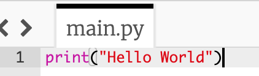

> **Hello World** (en français Bonjour le monde) est un programme simple qui est traditionnellement écrit pour donner un exemple rapide d'un langage de programmation (lors de l'apprentissage de celui-ci ou d'un simple test).
>
> La longueur de ce programme varie en fonction du langage de programmation utilisé : il peut d'ailleurs être utilisé pour savoir si le langage est de bas niveau (proche du langage machine, Hello World long) ou de haut niveau (plus abstrait, Hello World court).
> [Vikidia](https://fr.vikidia.org/wiki/Hello_World)

Hello World en Python est: `print("Hello World")`

Qu'est-ce qui se passe ?

`print()` affiche la sortie. C'est une fonction

`"Hello World"` **est** la sortie. C'est une chaine de caractères

`"Hello World"` est aussi une paramètre de la fonction `print()`
