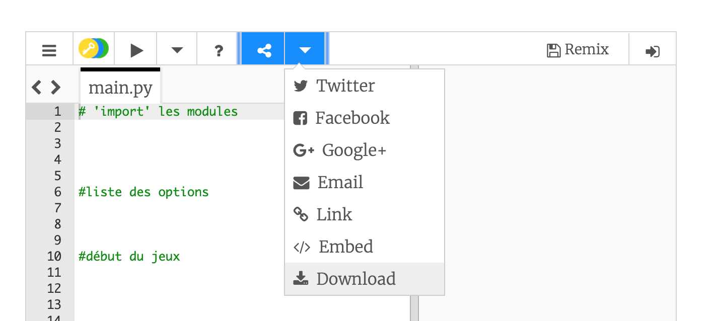

## Pierre, Feuille, Ciseaux en Python

**Attention - ce code va disparaitre une fois la page est rechargée. Si vous voulez le garder, cliquez sur 'Download'**

Aujourd'hui on va coder notre propre jeux !

### Projet : Aide

Voici quelques morceaux de code qui vont rendre le projet plus facile à faire.

